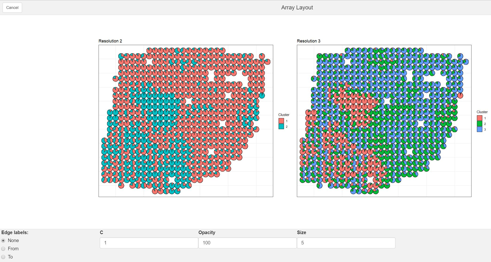
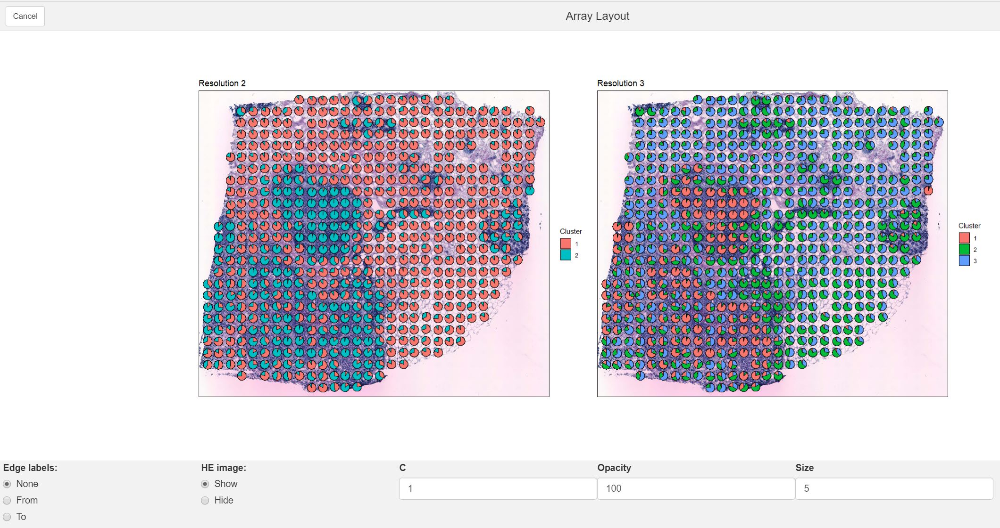
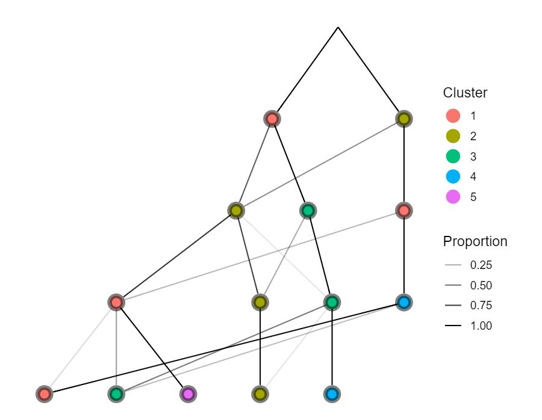

```{r setup, include = FALSE}
knitr::opts_chunk$set(
  collapse = TRUE,
  comment = "#>"
)
```

# Installation instructions

The SpatialCPie package is hosted on GitHub and can be installed via the `devtools` package. If `devtools` is not installed, begin by:

```{r, eval=FALSE}
install.packages("devtools")
```

The SpatialCPie package is then installed via:

```{r, eval=FALSE}
library(devtools)
install_github("jbergenstrahle/SpatialCPie")
```

To load and use the SpatialCPie package use:

```{r, eval=TRUE, message=FALSE, warning=FALSE}
library(SpatialCPie)
```

## Dependencies

The package uses **shiny gadets** to present UI elements for clustering and visualization. The creation of network diagrams, graphical elements, image processing and other tasks depend on a set of R packages, which are available on CRAN. These are automatically detected and installed during the installation process.  

# Standard workflow

## Prior to analysis in R

SpatialCPie is specifically created to deal with Spatial Transcriptomics data (ST; http://www.spatialtranscriptomicsresearch.org/). Other data and image processing pipelines can also be used, but the data input format needs to be in the form of the standard ST pipeline output (see below). As a general workflow, the ST data are processed through the ST pipeline (https://github.com/SpatialTranscriptomicsResearch/st_pipeline), and then the tissue image is aligned to the spatial areas via the ST spot detector (https://github.com/SpatialTranscriptomicsResearch/st_spot_detector).

Following the standard pipeline, the result is three files that could be used as input to SpatialCPie. However, only the count matrix is required in order to run SpatialCPie.

{width=600px}

## Read in data

To follow along the code presented in the vignette, the data used are found [here](https://kth.box.com/s/5z8pdzugykywt539yx89a9k0htn6nuik). Download and load the RData file. This file contains two example expression count files and spatial coordinates. The [H&E tissue image](https://kth.box.com/s/h0zytefj7zk775tm68510axvmozhis4w) is also provided if the user wants to overlay the arrayplots with the H&E stained image.  

The SpatialCPie package is a visualization tool that uses shiny gadgets, which are called within R and launches an UI window that the user can interact with. It also contains a function to parse the ST spot detector output file if needed. The typical workflow starts by loading the count matrix that is the output from the ST pipeline. This is generally done as follows:

```{r, eval=FALSE}
counts = read.table("countsFromSTpipeline.tsv")
counts = t(counts)
```

The standard ST pipeline output needs to be transposed, so that the count matrix consists of spatial areas---"spots"---in the columns and genes in the rows:

```{r, eval=TRUE, echo=FALSE, results='asis'}
setwd('..')
load("data/fetalHeartCountsPrepared.RData")
knitr::kable(head(counts[,1:5], 5))
```

Load the data sets or continue with your own count matrix. The spot data file and the tissue image are optional inputs but needed in order to overlay the array plots on the H&E stain.

```{r, eval=FALSE, echo=TRUE}
load("SpatialCPieData.RData") #Provided RData file
```

In the most basic form, the clustering is based on the raw gene count values obtained during the experiment, but can be based on any numerical values derived from the gene expression values. It's recommended to conduct some filtering steps prior to the analysis, including removal of spatial areas that are outside of the tissue, removal of spatial areas with insufficient data (in terms of, e.g., the number of genes detected or the total number of transcripts), as well as removal of genes with insufficient data across the tissue section.

## Cluster calculation

The idea of the visualization gadget is to display cluster relationships obtained from multiple cluster *resolutions*, i.e., the number of clusters that the features should end up in. The first step is to create such an input list of resolutions. This is easily done via base R functions, or even more convinient via the use of the `tidyverse` package. An example is shown below after some filtering of the spots. 

```{r, eval=FALSE}
#Lets remove the spots that are outside of the tissue
D2spotsUnderTissue = paste(D2spots$V1, D2spots$V2, sep="x")
D2spotsUnderTissue = D2spotsUnderTissue[2:length(D2spotsUnderTissue)]
D2counts = D2counts[, which(colnames(D2counts) %in% D2spotsUnderTissue)]

```

```{r, eval=FALSE}
library(purrr)
clusters = 2:5 %>% map(~kmeans(t(D2counts), centers=.)$cluster)

```


## Vizualization

### Without tissue image

The count data and the cluster list is used as input to the `runCPie` gadget:

```{r, eval=FALSE}
viz = runCPie(D2counts, clusters)
```

This opens an interactive UI. The *clustering tree* is interactive, and by selecting different cluster resolutions, the spatial arryplot with the spots will be shown above. By deafault, all the resolutions are loaded. Note: depending on the number of resolutions used, loading might take some time at startup. 

The default viewing option is a modal window. Depending on the size of the plots and the resolution on the user screen, this can be experienced as too small. If this is the case, try view option set to "browser".

```{r, eval=FALSE}
viz = runCPie(D2counts, clusters, view="browser")

```

## The spatial array

{width=600px}

This plot show the spatial location of the clusters. The pie diagrams are based on a "likeness score" between the individual spatial areas and each cluster. The likeness score (L) is calculated as:
$L = exp(distance*c)$
Where distance is the euclidean distance between the spatial spot and the cluster centroids, as determined during the kMeans clustering. C is a constant that the user can choose (default value = 1).

If the user wants to display hard label kMeans clustering, just crank the C parameter up to a high value (e.g. 10).

### With tissue image

The tissue image obtained during the ST experiment can be used as a background to the array plot.

In order to display the image, pixel coordinates of the spots need to be provided.
The `parseSpotFile` function can be used to extract the pixel coordinates from a *spot file*, obtained from the ST spot detector:

```{r, eval=FALSE}
coords <- parseSpotFile("spot_data-sel-BC24044_D2.tsv")
#In the provided RData file, coords is already loaded
```

If the image was scaled after using the spot detector tool, the pixel coordinates will not match and need to be scaled accordingly. This is easily done by multiplication of the coordinates with the scaling factor `coords * [scale-Factor]`

Image loading can, for example, be done with the `jpeg` package:

```{r, eval=FALSE}
library(jpeg)
HE_img = jpeg::readJPEG( [path to image] )
```

And then we call the gadget:

```{r, eval=FALSE}
viz = runCPie(D2counts, clusters, img = HE_img, pixel.coords = coords)
```

The "HE" checkbox is used to plot the uploaded image as a background to the array plot (note: it might take some time to load the plot if the HE image is large). To increase the visibility of the HE image, it's possible to lower the opacity of the spots.

{width=600px}

## The clustering tree

{width=600px}

The clustering tree is a visual representation of how the spatial features transition from clusters of lower resolution to clusters of higher resolution. The checkboxes "From" and "To" can be used to put labels on the edges, showing the proportion of the spatial areas that move between clusters. "From" takes the perspective of the cluster of lower resolution and shows the ratio of spots that move along each of the outgoing edges. "To" takes the perspective of the cluster of higher resolution and shows the ratio that moves along each of the incoming edges.

{width=600px}

### Selecting clusters for downstream applications

The clustering tree is interactive: by clicking on a node, all nodes at the same resolution get selected. Multiple cluster resolutions can be selected simultaneously in this way. When pressing DONE, the gadget will close and output the cluster configurations of the selected resolutions.

The ggplot objects that were displayed in the gadget are included in the output object.
The structure of the output is:

- `$ tree`: ggplot2 object
- `$ piePlots`: ggplot2 objects, selected resolutions
- `$ piePlotsInfo`: Data frame with ratios used for Pie chart creation (based on the similarity score)

All the plots are saved as they were displayed in the UI when pressing "Done".
If multiple resolutions was selected the individual arrayplots are obtained by specifying the resolutions, e.g. if the user wants to plot resolution 4:

```{r, eval=FALSE}
viz$piePlots$`4`
```

# Subcluster part of the tissue areas

After a "global" analysis across the entire tissue section, it is often interesting to sub-cluster parts of the spatial areas. This can be achieved via cluster selection in the gadget and subsequent sub-sampling of the clusters that the user want to re-cluster further. For example, running

`spots = names(clusters[[2]][clusters[[2]] %in% c(2,3)])`

would give the spatial locations of cluster 2 and 3 in clustering resolution 4. These names could then be used to sub-sample the original count matrix:

```{r, eval=FALSE}
subCounts = D2counts[, spots]
```

The sub-sampled matrix can then be used again with the gadgets:

```{r, eval=FALSE}
subClusters =  2:5 %>% map(~kmeans(t(subCounts), centers=.)$cluster)
viz = runCPie(subCounts, subClusters)
```

And the clustering tree could be used for another round of sub-clustering etc.

. If the user wants to make use of the plots and diagrams produced by `CPieViz` in papers, presentations, etc., it is possible to extract and manually alter them. An example of how to save a high-resolution plot with the H&E image is shown below. Running this will save a .pdf image at the desired path.

```{r, eval=FALSE}
library(jpeg)
library(grid)

#counts = our count matrix
xcoord = as.numeric(sapply(strsplit(colnames(counts), "x"), "[[", 1))
ycoord = as.numeric(sapply(strsplit(colnames(counts), "x"), "[[", 2))
coord_df = as.data.frame(cbind(x=xcoord, y=ycoord))
df <- cbind(coord_df, color=as.factor(as.character(viz$clusters$`4`)))

#read in the image and make a rasterGrob
he.image = readJPEG("HE_BT24044_D2.jpg")
grobHE <- rasterGrob(he.image, width = unit(1, "npc"), height = unit(1, "npc"), interpolate = TRUE)

#The scales are manually adjusted
ggPIE = ggplot(df, aes(x=x, y=36-y, colour=color))+
          labs(colour="Cluster")+
          scale_x_continuous(limits = c(1, 33), expand = c(0,0))+
          scale_y_continuous(limits = c(1, 35), expand = c(0,0))

#Specify the output name of the picture
out.file = "HE_BT24044_D2_Supp_4clusters.pdf"
pdf(out.file, onefile = TRUE, useDingbats = FALSE, height = 35 * 0.5, width = 33 * 0.5)

#We add our image as background to our ggplot object
ggPIE = ggPIE + annotation_custom(grobHE, -Inf, Inf, -Inf, Inf)

#We use viz$arrayPiePlotsPieInfo to extract info regarding the pie chart ratios for cluster dimension 4 that we extracted earlier
ggPIE + geom_scatterpie(data=viz$arrayPiePlotsPieInfo[[4]], aes(x=x, y=36-y, r=0.5),
                                     cols=colnames(viz$arrayPiePlotsPieInfo[[4]][1:4]), alpha=0.5)

dev.off()

```


